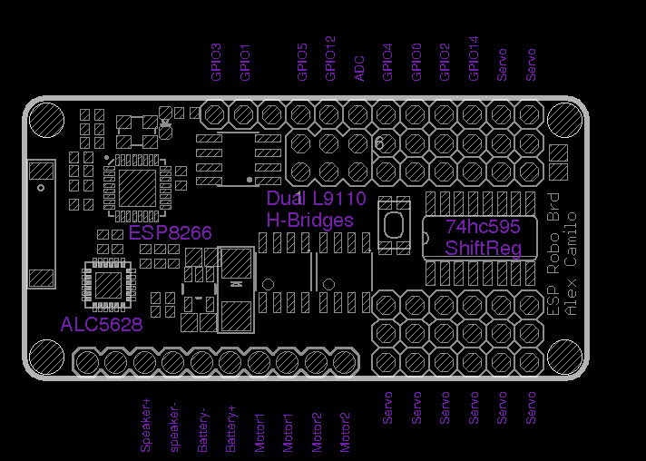
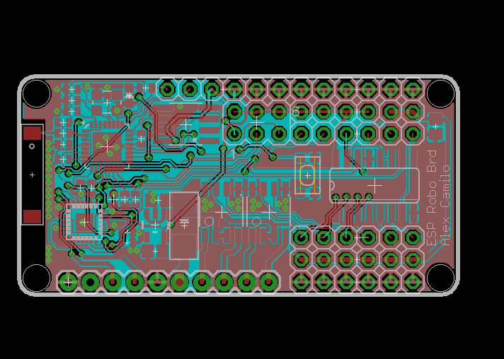
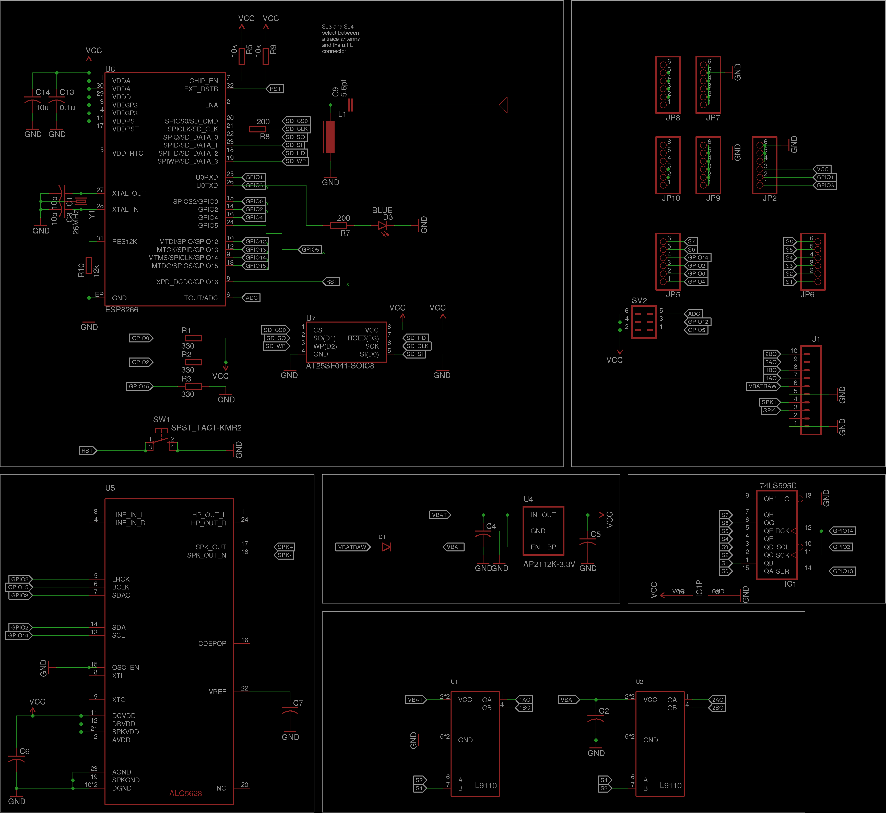

## ESP8266 Robotics Board ##

The ESP-Robotics-Board is intended for building robots out of old toys.

- ESP8266-12 wifi module
- Dual L9110 (800ma) H-Bridge ICs
 - For small DC motors.
- ALC5628 DAC+AMP
 - Drive an 8 0hm speaker
- Screw Terminals to attatch motors, bettery, speakers
 - Strip wires in up-cycled toys and attatch directly to the board.
- Drive up to 8 servoes
 - 1 motor, 6 servoes
 - 2 motors, 4 servoes
 - 8 GPIO for sensors
  -i2c broken out
  -ADC broken out
